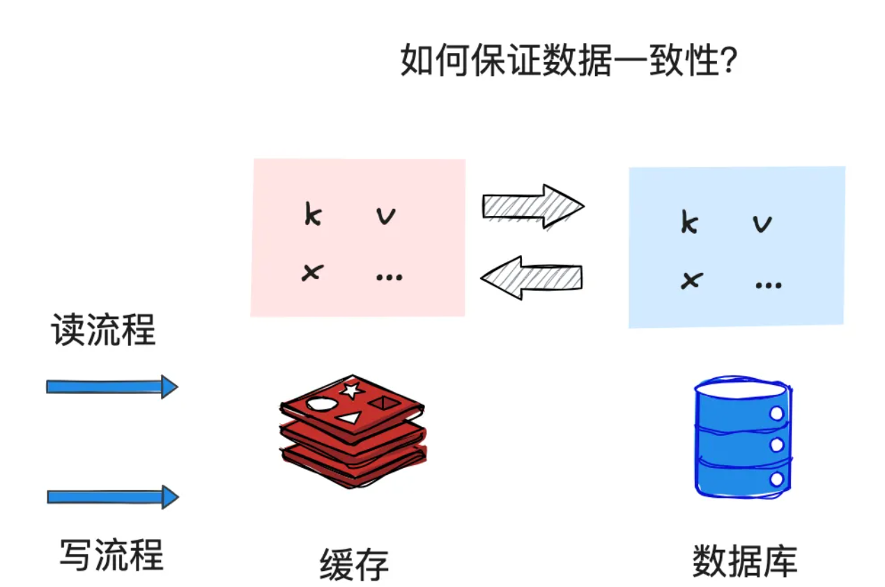
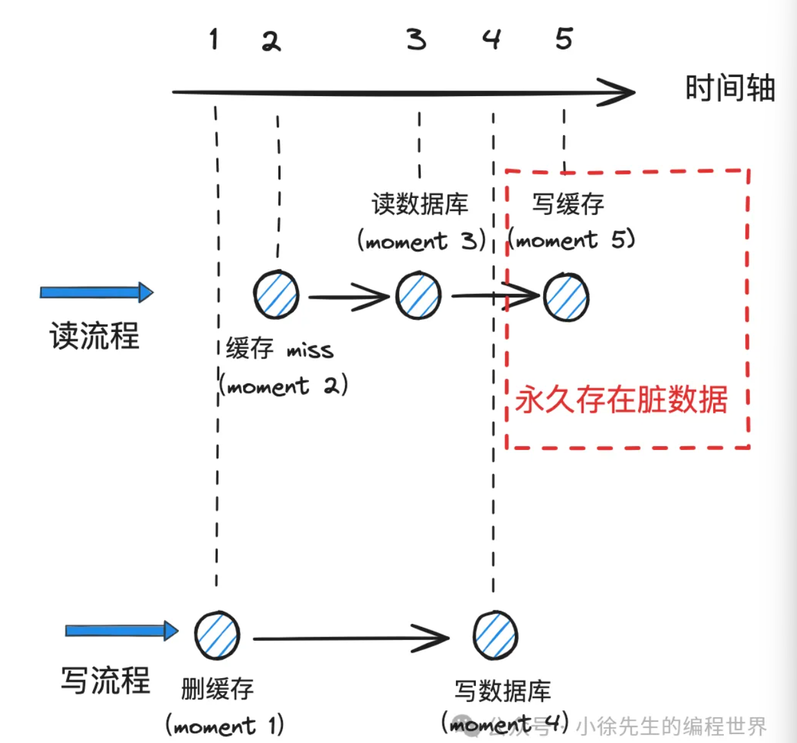

## 一致性缓存缓存理论

### 缓存一致性问题
缓存（cache） 相比于数据库（db） 而言更加轻便快捷，但与之相对的也存在成本高、容量小、稳定性弱的问题，因此 cache 中的数据通常是依附于 db 中的持久化数据而存在，一笔数据的更新操作和存储终态最终还是要以 db 为准.

从这个角度出发来看，在写操作密集的场景下，使用 cache 的收益并不明显；然而在读多写少的场景中，我们通过将一些相对稳定不变的数据从 db 冗余到 cache 中，**由 cache 同一收口数据查询能力，能够很大程度提升查询性能并降低 db 的访问压力.**

cache 和 db 本身是两个独立的存储组件，跨组件间的数据一致性问题属于分布式事务的范畴。但受限于其高昂的实现成本，因此不适用于绝大多数场景。

### 读写流程 + 缓存更新策略

**Read/Write Through(读穿/写穿)策略**
Read/Write Through（读穿 / 写穿）策略原则是应用程序只和缓存交互，不再和数据库交互，而是由缓存和数据库交互，相当于更新数据库的操作由缓存自己代理了
1. **Read Through 策略**
   先查询缓存中数据是否存在，如果存在则直接返回，如果不存在，则由缓存组件负责从数据库查询数据，并将结果写入到缓存组件，最后缓存组件将数据返回给应用。
2. **Write Through 策略**
   当有数据更新的时候，先查询要写入的数据在缓存中是否已经存在：
   + 如果缓存中数据已经存在，则更新缓存中的数据，并且由缓存组件同步更新到数据库中，然后缓存组件告知应用程序更新完成。
   + 如果缓存中数据不存在，直接更新数据库，然后返回。

**Write Back（写回）策略**
Write Back（写回）策略在更新数据的时候，只更新缓存，同时将缓存数据设置为脏的，然后立马返回，并不会更新数据库。对于数据库的更新，会通过批量异步更新的方式进行。

实际上，Write Back（写回）策略也不能应用到我们常用的数据库和缓存的场景中，因为 Redis 并没有异步更新数据库的功能。

Write Back 是计算机体系结构中的设计，比如 CPU 的缓存、操作系统中文件系统的缓存都采用了 Write Back（写回）策略。

**Cache Aside 策略，中文是叫旁路缓存策略**

+ 在**写流程**中：只负责写 db，不负责更新 cache；与之相对的，需要在写 db 前，先负责将 cache 中的脏数据删除，由后续到来的读操作负责将更新后的迁移到缓存中
+ 在**读流程**中：尝试读cache；如果 cache 中数据 miss，则读取 db，并将读到的数据更新到 cache 中，以便后续的读操作复用

**question A：为什么写流程不在写完 db 后直接更新 cache 数据？**
+ 原因I：cache 相比于 db 空间小、成本高，因此希望尽可能将访问频繁的热数据加载到 cache 中进行复用. 而 cache 的目标是面向读密集场景，数据的热度由读操作的频率来决定，因此将写 cache 的执行权交由读流程负责，而非写流程；
+ 原因II：在明确已经由读流程负责写 cache 的前提下，写流程就不再执行重复动作，以此实现流程简化，也能规避部分因并发场景而导致的 cache 数据一致性问题

**question B：为什么写流程需要删除 cache 数据？**
+ 在读流程中，当 cache 中存在数据，会立即读取并返回结果. 因此倘若写操作不删除 cache 中的脏数据，那么后续到来的读操作都会因此读取到错误的结果.
+ 当写操作删除 cache 删除后，读流程访问 cache 时发现数据 miss，就会读取 db，并将此时正确的数据重新写入 cache 中

**question C：为什么写流程需要先删除 cache 再写 db？**
+ 逆向思考：倘若先写 db 后删 cache，由于两个操作无法保证原子性，一旦前者成功后者失败，就会导致 cache 中永久存在错误的数据；
+  反之，先删 cache 后写 db，哪怕前者成功后者失败，无非是额外增加一次将数据由 db 冗余到 cache 中的成本而已

**哪些环节可能存在 cache 数据不一致问题？**

（1）moment1：写流程删除 cache 中的 key:a 数据

（2）moment2：读流程读 cache，发现 key:a 数据 miss，准备进一步读 db

（3）moment3：读流程读 db，此时数据还是老版本，value 为 b

（4）moment4：写流程写 db，将 key:a 对应 value 更新为 c

（5）moment5：读流程把读到的 value:b 作为 key:a 的映射数据写入 cache

至此，读、写流程均结束了，然而现状是，db 中 key:a 数据已经更新为 c，然而 cache 中 key:a 对应的还是脏数据 b.

**缓存双删策略——即在写流程写 db 前后，分别执行一次删除 cache 操作**

以上述案例加以说明，就是写流程在 moment4 之后，额外增加一个 moment6，再一次将 cache 中 key:a 对应的数据删除.

### 缓存延时双删策略
缓存双删中存在的问题其实很简单，就在于我们无法保证，写流程中，第二次删除 cache 的动作一定能执行在读流程写 cache 的操作之后，也就是 moment5 和 moment6 两个时刻的相对次序是不稳定的
我们进一步引入缓存延时双删策略. 这里的“延时”就体现在，写流程写完 db 后，会等待指定时长，保证此期间可能持有脏数据的读流程都完成写 cache 操作后，再执行第二次的删 cache 操作，以此来实现缓存数据的“最终一致性”语义.

### 写缓存禁用机制

缓存延时双删机制同样有其短板所在，核心分为两点：
+ **cache 数据弱一致**：写 db 到延时执行二次删 cache 操作期间，cache 中都可能存在脏数据，因此无法保证 cache 数据的即时一致性，只能保证最终一致性语义
+ **二次删 cache 操作不稳定**：延时二次删 cache 操作存在执行失败的可能性，一旦失败，cache 数据的“最终一致性语义”都将无法保证

在分布式场景，我们往往需要在流程性能和数据一致性之间进行权衡取舍. 为了进一步保证 cache 数据的强一致性语义，我们可以尝试引入“锁机制”.

最简单粗暴的实现方式，就是通过一把 key 维度的分布式读写锁，实现读流程和写流程的隔离. 这样两个流程下的执行步骤也就不会混淆在一起，上述问题自然也就得到了根除.

然而，该做法的代价却是对读操作性能的大幅度牺牲，针对某笔数据，一旦产生写操作，那么在此期间所有读操作都要陷入阻塞等待的状态，这并不是我们所乐于接受的.

**导致 cache 数据不一致的罪魁祸首，本质上是读流程把脏数据写入 cache 的操作，而非宏观意义上的整个读流程.**

因此，我们要做的不是完全隔离读、写流程，也不需要使用分布式锁这么重的工具，而是退而求其次，针对一笔数据的维度启用一个 “开关” 机制，能够用于控制读流程是否启用写 cache 机制即可：
+ 每当有写流程到达时，先将该笔数据的“开关”关闭，然后正常执行后续流程，执行完成后再重新将“开关”打开
+ 在“开关”关闭期间，所有到达的读流程正常执行步骤，唯独不会在读 db 后执行写 cache 操作

通过上述的 “写缓存禁用”机制，就保证了数据的强一致性. 写流程执行期间，该笔数据对应的读流程不会阻塞，只是相当于 cache 机制被暂时屏蔽，读流程需要统一从 db 中获取最精确的数据而已.

此处值得一提的是，在写流程完成写 db 操作后，通过需要延迟一段时间再重新开启该笔数据下的 “写缓存机制”，其本质思路和缓存延时双删策略中“延时”的用意是一致的，就是避免在并发场景下，读取到 db 脏数据的读流程写 cache 操作恰好发生在写流程“写缓存机制”启用之后.

### 其他缓存相关问题

#### 缓存雪崩
倘若导致大量 cache key 在同一时刻过期，那么这一瞬间纷涌而至的大量读请求都会因为 cache 数据 miss 而集体涌入到 db 中，导致 db 压力陡增.

缓存雪崩问题的常用解决思路是切断问题的直接导火索，
+ 对 cache key 的过期时间进行打散，比如可以在预设过期时间的基础上，加上随机扰动值，因此来避免大面积 cache key 同时失效的情形
+ 设置缓存不过期：我们可以通过后台服务来更新缓存数据，从而避免因为缓存失效造成的缓存雪崩，也可以在一定程度上避免缓存并发问题。

#### 缓存击穿
如果缓存中的某个热点数据过期了，此时大量的请求访问了该热点数据，就无法从缓存中读取，直接访问数据库，数据库很容易就被高并发的请求冲垮，这就是缓存击穿的问题

可以发现缓存击穿跟缓存雪崩很相似，你可以认为缓存击穿是缓存雪崩的一个子集。 应对缓存击穿可以采取前面说到两种方案：
+ 互斥锁方案（Redis 中使用 setNX 方法设置一个状态位，表示这是一种锁定状态），保证同一时间只有一个业务线程请求缓存，未能获取互斥锁的请求，要么等待锁释放后重新读取缓存，要么就返回空值或者默认值。
+ 不给热点数据设置过期时间，由后台异步更新缓存，或者在热点数据准备要过期前，提前通知后台线程更新缓存以及重新设置过期时间
 
#### 缓存穿透
倘若读操作频繁请求 db 中不存在的数据，那么该数据自然也无法写入 cache，最终所有请求都会直击 db，导致 db 压力较大.

应对缓存穿透的方案，常见的方案有三种。
+ **非法请求的限制**：当有大量恶意请求访问不存在的数据的时候，也会发生缓存穿透，因此在 API 入口处我们要判断求请求参数是否合理，请求参数是否含有非法值、请求字段是否存在，如果判断出是恶意请求就直接返回错误，避免进一步访问缓存和数据库。
+ **设置空值或者默认值**：当我们线上业务发现缓存穿透的现象时，可以针对查询的数据，在缓存中设置一个空值或者默认值，这样后续请求就可以从缓存中读取到空值或者默认值，返回给应用，而不会继续查询数据库。
+ **使用布隆过滤器快速判断数据是否存在，避免通过查询数据库来判断数据是否存在**：我们可以在写入数据库数据时，使用布隆过滤器做个标记，然后在用户请求到来时，业务线程确认缓存失效后，可以通过查询布隆过滤器快速判断数据是否存在，如果不存在，就不用通过查询数据库来判断数据是否存在，即使发生了缓存穿透，大量请求只会查询 Redis 和布隆过滤器，而不会查询数据库，保证了数据库能正常运行，Redis 自身也是支持布隆过滤器的。

